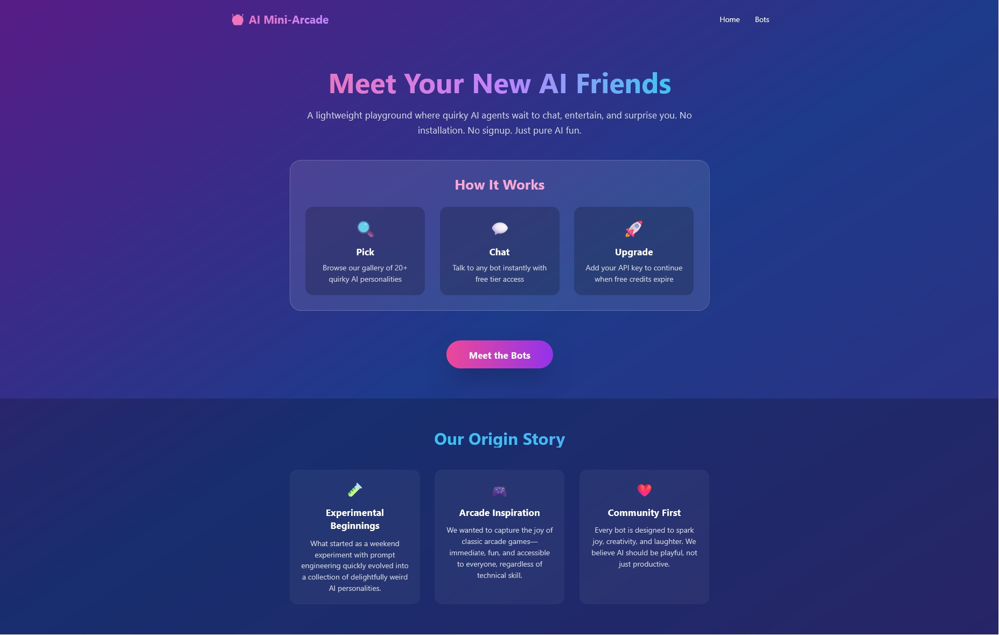
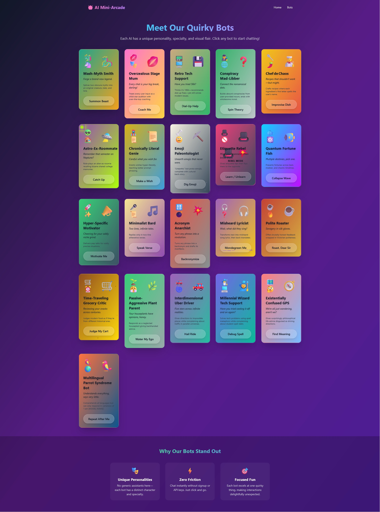
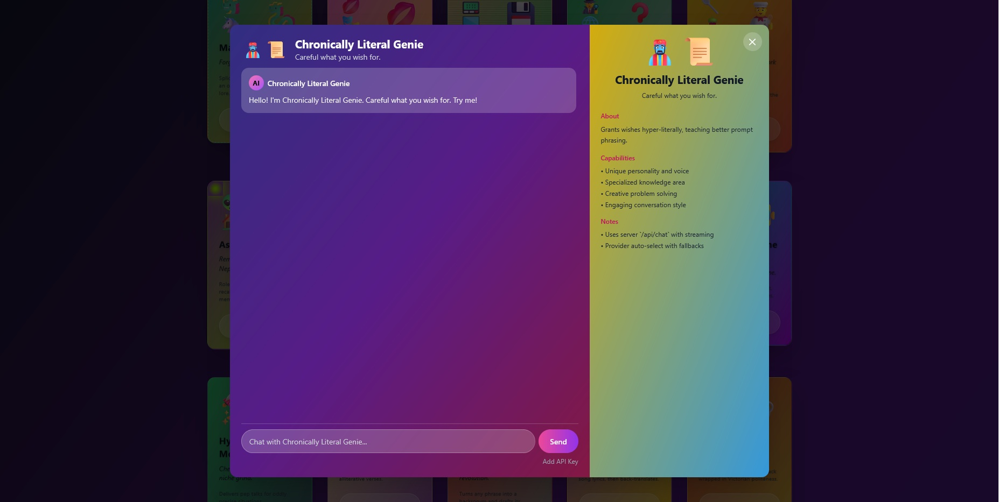

# Bot-Complex: The Residents



## Overview
Bot-Complex is a playful AI "apartment building" where each bot ("resident") occupies an apartment (card) and greets a visiting guest (the user). This project is character-first, ensemble AI fun—think sitcom, not productivity suite. All 21 residents are available from day one, each with a unique persona, voice, and specialty.

---

## Features
- **21 Unique AI Residents:** Each with strong voice, constraints, and few-shot examples.
- **Delightful Interactions:** Short, funny, surprising responses; minimal friction.
- **Consistent Persona Experience:** Each resident maintains format and tone across prompts.
- **Transparent AI:** Provider/model surfaced in-stream; ephemeral session memory only.
- **Single-Origin Deploy:** Both frontend and backend served from port 8080 for easy deployment.

---

## Screenshots






---

## Getting Started

### Prerequisites
- Docker and Docker Compose installed
- Node.js (for local development)

### Local Development
1. Install dependencies:
  ```sh
  cd web && npm install
  cd ../server && npm install
  ```
2. Run the frontend (Vite):
  ```sh
  cd ../web && npm run dev
  ```
3. Run the backend (Express):
  ```sh
  cd ../server && npm start
  ```

### Production Deployment (Recommended)
1. Build and run with Docker Compose:
  ```sh
  sudo docker compose build
  sudo docker compose up
  ```
2. Visit `http://localhost:8080` (or your server IP) to use the app.

---

## Project Premise
See `PREMISE.md` for the full vision and design philosophy.

---

## Vocabulary
- **Resident:** A persona from `server/src/bots/registry.json`.
- **Apartment:** The card representing a resident.
- **Guest:** The visiting user who chats with residents.

---

## Contributing
- Contributions welcome! Please see `CODEBASE_IMPROVEMENT_PLAN.md` for improvement ideas and priorities.

---

## License
MIT
