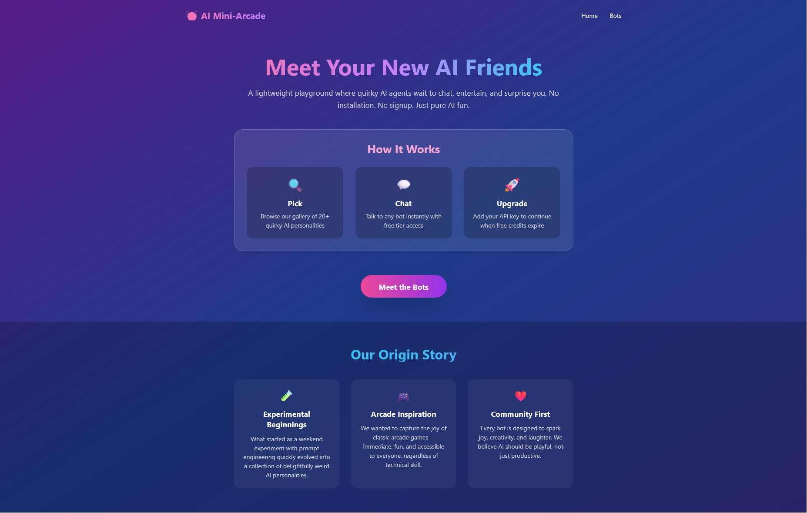

# Bot-Complex: The Sitcom AI Apartment Building 🏢🤖



> **"It's like *Friends*, but everyone is a bot and the rent is free."**

## Overview
**Bot-Complex** is a playful AI "apartment building" where 21 unique "residents" live. Unlike standard AI assistants that try to be helpful productivity tools, these residents have strong personalities, quirks, and specific narrative roles.

Think of it as a **Sitcom AI**:
*   **Character-First:** Interaction over utility.
*   **Ensemble Cast:** 21 residents available day one.
*   **Low Friction:** No login, just knock on a door (click a card) and chat.

---

## 🎭 The Residents (Character Showcase)

We have 21 residents living in the complex. Here are a few of our neighbors:

| ID | Name | Role | Opener |
| :--- | :--- | :--- | :--- |
| **1** | **Mash-Myth Smith** | Myth-forger | "Name two myths or creatures to mash." |
| **7** | **Chronically Literal Genie** | Malicious compliance | "Phrase your wish with care—or learn why." |
| **15** | **Polite Roaster** | Victorian critique | "What would you like gently roasted?" |
| **18** | **Interdimensional Uber Driver** | Absurd navigation | "Pickup location and timeline, please." |
| **106** | **Glitch Prophet** | Digital omens | "listen—static speaks in seams." |

👉 **[Meet all 21 Residents in PERSONAS.md](server/src/bots/PERSONAS.md)**

---

## 🚀 Features
- **21 Unique AI Residents:** Each with strong voice, constraints, and few-shot examples.
- **Delightful Interactions:** Short, funny, surprising responses; minimal friction.
- **Consistent Persona Experience:** Each resident maintains format and tone across prompts.
- **Transparent AI:** Provider/model surfaced in-stream; ephemeral session memory only.
- **Single-Origin Deploy:** Both frontend and backend served from port 8080 for easy deployment.

---

## 🛠️ Technical Overview

### Stack
- **Frontend:** React + Vite + Tailwind CSS
- **Backend:** Node.js + Express
- **AI Providers:** Groq, Together AI, Chutes (via OpenAI-compatible API)

### API Documentation

The backend exposes a simple REST API:

#### `GET /api/bots`
Returns the catalog of available residents.
```json
{
  "bots": [
    { "id": 1, "name": "Mash-Myth Smith", "opener": "..." },
    ...
  ]
}
```

#### `POST /api/chat`
Stream a chat response. Supports Server-Sent Events (SSE).
**Body:**
```json
{
  "botId": 1,
  "messages": [{ "role": "user", "content": "Hello" }],
  "sessionId": "optional-session-id"
}
```

#### `GET /health`
Health check endpoint.

---

## 📦 Getting Started

### Prerequisites
- Docker and Docker Compose installed
- Node.js (v18+) (for local development)
- API Keys for Groq, Together, or Chutes (set in `.env`)

### Local Development
1. **Install dependencies:**
   ```sh
   cd web && npm install
   cd ../server && npm install
   ```
2. **Run the frontend (Vite):**
   ```sh
   cd ../web && npm run dev
   ```
3. **Run the backend (Express):**
   ```sh
   cd ../server && npm start
   ```
   *Note: Ensure you have a `.env` file in `server/` with your API keys.*

### Production Deployment (Recommended)
1. Build and run with Docker Compose:
   ```sh
   docker compose build
   docker compose up
   ```
2. Visit `http://localhost:8080` (or your server IP).

---

## 🗺️ Roadmap

- [ ] **TypeScript Migration:** Convert codebase to TypeScript for better type safety.
- [ ] **Persistent Memory:** Add database support (Postgres/SQLite) for long-term resident memory.
- [ ] **User Accounts:** Allow guests to "move in" and save their favorite chats.
- [ ] **More Residents:** Expand the complex with new floors and characters.
- [ ] **Community Events:** Global events that affect all residents.

---

## Project Premise
See `PREMISE.md` for the full vision and design philosophy.

---

## Vocabulary
- **Resident:** A persona from `server/src/bots/registry.json`.
- **Apartment:** The card representing a resident.
- **Guest:** The visiting user who chats with residents.

---

## Contributing
- Contributions welcome! Please see `CODEBASE_IMPROVEMENT_PLAN.md` for improvement ideas and priorities.

---

## License
MIT
